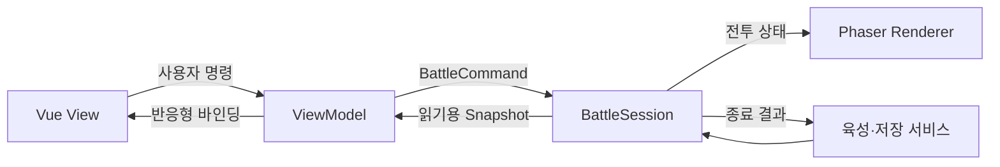

# 플럼잼 프로토타입 구현 계획

## 1. 목표와 기본 구성

[게임 명세](/Users/hajung/Plumjam/SPEC.md)를 기준으로 PC에서 플레이 가능한 `1-1`~`1-5`를 만든다. 첫 보스는 GPT-4o이며, 주인공 조작·병력 소환·공유 자금·경제 투자·육성·레벨 5 외형 변화를 구현한다.

- **기술:** Phaser 4.2.1 + Vue 3 + TypeScript + Vite.
- **UI:** Vue 기반 MVVM으로 확정한다. ViewModel을 얇게 유지하고 Vue의 반응형 바인딩을 사용한다.
- **전투:** 단순한 TypeScript 객체와 배열로 구성한다. 좌표·거리·HP로 직접 판정하며, 성능 최적화보다 구현 속도와 수정 편의성을 우선한다.
- **표현:** 도트 아트와 블랙코미디. 일자리를 지키려는 인간들의 허둥거림과 AI 침공의 불길함을 함께 보여준다.
- 현재 레포에는 명세와 학교 심볼만 있다. 기존 코드·저장 데이터 마이그레이션은 필요하지 않다.

## 2. 코드 아키텍처와 수명 관리

### 구성과 소유권

| 구성 | 책임 | 수명 |
| --- | --- | --- |
| `AppContext` | 저장 서비스, 육성 상태, 콘텐츠 정의, 씬 전환, UI 브리지 | 앱 실행 전체 |
| `SceneLifetimeManager` | 씬 실행마다 자원 등록·해제, 종료된 실행의 콜백 차단 | 매니저는 앱 전체, Scope는 씬 실행마다 |
| `BootScene` | 공용 이미지·오디오 로딩 | 초기 로딩 |
| `LobbyScene` | 스테이지 선택·육성 화면의 배경 | 로비 방문마다 |
| `BattleScene` | 입력 연결, 전투 진행, Phaser 렌더링 | 전투 실행마다 |
| `BattleSession` | 이동·소환·전투·스킬·경제·승패 판정 | 전투 실행마다 |
| 각 `ViewModel` | 표시 상태, 버튼 사용 가능 여부, 사용자 명령 | 해당 화면 또는 씬 Scope |

씬은 **Boot → Lobby → Battle**로 구성한다. 승패 결과는 별도 씬 대신 정지된 전장 위에 Vue 패널로 표시한다. 결과 화면에서 재시작하거나 로비로 나가면 이전 전투 Scope를 해제한다.



### 씬 수명 매니저

`src/core/SceneLifetimeManager.ts`에 다음 계약을 둔다.

```ts
interface SceneScope {
  readonly id: number;
  readonly signal: AbortSignal;
  readonly disposed: boolean;
  defer(cleanup: () => void): void;
  dispose(): void;
}

interface SceneLifetimeManager {
  begin(scene: Phaser.Scene): SceneScope;
  dispose(scene: Phaser.Scene): void;
}
```

- 각 씬의 `init()`에서 새로운 Scope를 생성한다. 재시작할 때 이전 전투 모델과 ViewModel을 재사용하지 않는다.
- `SHUTDOWN`과 `DESTROY` 모두 같은 멱등 `dispose()`에 연결한다. cleanup은 역순 실행하고, 하나가 실패해도 나머지 해제를 계속한다.
- Scope가 외부 이벤트 구독, Vue 효과, DOM 이벤트, 씬 전용 사운드, 비동기 작업과 자체 컬렉션을 정리한다.
- Phaser가 소유하는 GameObject·씬 타이머·Tween은 엔진 수명에 맡긴다. 공용 텍스처와 애니메이션 정의는 앱 종료까지 유지한다.
- 일시정지는 Scope를 해제하지 않는다. 재개할 때 그대로 이어가며, 정지 중 전투 명령은 받지 않는다.
- 모든 전투 연결에는 실행 ID를 붙여 이전 전투의 지연 콜백이 새 전투를 변경하지 못하게 한다.

이 구분은 [Phaser 4.2.1 씬 수명 소스](https://github.com/phaserjs/phaser/blob/v4.2.1/src/scene/Systems.js)에 따른다.

### 모델·MVVM 연결

- `src/game/BattleSession.ts`는 Phaser와 Vue를 참조하지 않는다. `step(deltaSeconds)`, `dispatch(command)`, `snapshot()`을 제공한다.
- `BattleCommand`는 이동 방향, 병력 소환, 스킬 사용, 경제 업그레이드로 구성한다. 버튼과 단축키 모두 같은 명령 경로를 사용한다.
- `BattleSnapshot`에는 실행 ID, 진행 상태, 자금, 기지·주인공 HP, 쿨타임, 유닛·투사체 상태를 담는다. Scene이나 Sprite 참조는 포함하지 않는다.
- `src/ui/viewmodels/`의 ViewModel은 snapshot을 받아 `shallowRef`와 `computed`로 표시 상태를 만든다. View가 전투 모델을 직접 수정하지 않는다.
- Phaser 인스턴스는 `markRaw` 또는 `shallowRef`로 보관한다. 씬 Scope 종료 시 ViewModel의 효과와 브리지 구독도 해제한다. [Vue 외부 상태 연동 문서](https://vuejs.org/guide/extras/reactivity-in-depth.html#integration-with-external-state-systems)
- 육성 데이터는 버전 1 저장 구조로 관리한다. 공용 육성 재화, 캐릭터별 레벨, 클리어·해금 상태, 음소거 설정을 저장한다.
- 승리 보상은 실행 ID 기준으로 한 번만 지급한다. 결과 표시나 재시작 버튼이 보상을 다시 지급하지 않는다.

## 3. UI·UX와 생성 에셋

### 화면 흐름

- **로비:** `1-1`~`1-5` 진행 경로와 육성 탭을 제공한다. 잠금·클리어·보스 스테이지를 구분하고, 클리어한 맵은 바로 재도전할 수 있다.
- **육성:** 캐릭터 카드에 현재 레벨, 강화 비용, 다음 효과와 레벨 5 외형 미리보기를 표시한다. 재화 부족과 최대 레벨 상태를 명확히 보여준다.
- **전투 상단:** 아군 기지 HP, 주인공 HP, 적 기지 HP, 공유 자금을 표시한다. 주인공 HP가 낮으면 초상과 HP 영역으로 위험을 강조한다.
- **전투 하단:** 병력 3종, 스킬 3종, 경제 업그레이드를 묶어 배치한다. 비용·단축키·쿨타임·사용 불가 이유를 항상 읽을 수 있게 한다.
- **결과:** 승패 원인, 획득 재화, 재도전·육성·다음 스테이지 버튼을 표시한다. `1-5` 클리어 후에는 프로토타입 완료를 표시한다.
- **조작:** `A/D`·방향키 이동, `1/2/3` 소환, `J/K/L` 스킬, `U` 경제 강화, `Esc` 일시정지. 브라우저 포커스를 잃으면 이동 입력을 초기화하고 자동 일시정지한다.

첫 진입 안내는 이동·병력 소환·공유 자금 설명을 짧게 제공한다. 자금 부족이나 쿨타임 때문에 실패한 입력에는 짧은 메시지를 보여준다.

### 시각 방향

- 인간 진영은 따뜻한 사무실 색감, 서류·가방·낡은 컴퓨터와 과장된 피로 표현을 사용한다.
- AI 진영은 차가운 서버 색감과 정돈된 형태로 시작해 후반에 기괴하게 변화시킨다.
- 배경은 초반·중반·보스전의 **3종**을 생성해 5개 스테이지에서 재사용한다. 후반에도 캐릭터와 HUD 대비는 유지한다.
- 캐릭터는 주인공·아군 3종의 기본/레벨 5 모습, 로봇 2종, GPT-4o를 생성한다. 필수 제공 에셋이 있으면 해당 원본을 우선 적용한다.
- 캐릭터는 투명 배경의 단일 포즈를 기본으로 한다. 이동 bob, 공격 기울임, 피격 색 변화, 사망 축소로 표현하며 정교한 스프라이트시트 제작을 선행 조건으로 삼지 않는다.
- 이미지 안에 UI 문자를 생성하지 않는다. `Hello World`, 졸음 표시, 대사와 수치는 코드로 표시한다.
- 전장 논리 크기는 **640×280**, 하단 HUD를 포함한 화면은 **16:9**로 구성한다. `pixelArt: true`와 비율 유지 스케일을 사용하고, 한국어 UI는 선명한 DOM 글자로 표시한다. [Phaser 도트 설정 소스](https://github.com/phaserjs/phaser/blob/v4.2.1/src/core/Config.js)
- 에셋 키와 전투 데이터를 분리한다. 학교 심볼 원본·출처 기록을 유지하며, 늦게 전달된 필수 에셋도 전투 코드 변경 없이 교체한다.

## 4. 구현 순서

1. **프로젝트와 수명 골격**
   공식 [Vue·TypeScript 템플릿](https://github.com/phaserjs/template-vue-ts)을 참고해 Phaser를 4.2.1로 고정한다. 세 씬, AppContext, Scope 매니저, 브리지를 구현한다. 템플릿의 이벤트 구독에는 대응 해제를 추가한다. 빈 화면 전환·재시작과 개발/프로덕션 빌드를 확인한다.

2. **임시 그래픽으로 한 판 완성**
   주인공 이동, 근접·원거리 병력, 적의 가장 가까운 대상 공격, 공유 자금, 경제 강화, 승패·재시작을 구현한다. 전투 모델과 렌더러를 분리한 상태에서 끝까지 플레이할 수 있게 만든다.

3. **스킬·지원·MVVM HUD**
   Hello World, 이동속도만 감소시키는 `sleep()`, 주변 아군 힐과 서비스직 랜덤 지원을 구현한다. 지원 효과는 일정 주기마다 선택하며 프레임마다 확률을 굴리지 않는다. 자금·쿨타임 검증은 모델에서 처리한다.

4. **5개 스테이지와 영구 육성**
   스테이지별 등장 일정·보상·분위기를 데이터로 구성한다. GPT-4o는 `1-5` 시작에 출현시켜 반드시 만나게 한다. 순차 해금, 반복 클리어 보상, 캐릭터별 강화, 저장과 레벨 5 외형을 연결한다.

5. **생성 에셋·연출·최종 조정**
   생성한 도트 배경과 캐릭터를 적용하고 대사·효과음·피격 피드백을 다듬는다. 실제 플레이로 초기 수치를 조정한 뒤 정적 빌드를 검증한다. 웹 공개 배포는 제출 조건에 맞춰 별도 단계로 진행한다.

초기 기본값은 최대 레벨 10, 서비스직의 세 효과는 동일 확률, 동일 버프는 중첩 대신 지속 시간 갱신으로 정한다. `sleep()`은 첫 보스에도 적용한다. 시간 제한은 두지 않고, 같은 판정 단계에서 주인공·아군 기지가 파괴됐다면 패배를 우선한다. 나머지 전투 수치는 명세에서 위임한 대로 에이전트가 설정하고 플레이로 조정한다.

## 5. 검증과 완료 기준

- **모델 테스트:** 자금 중복 사용·음수 방지, 실패한 행동의 비용 미소비, 가까운 대상 선택, 주인공 사망 패배, 투사체의 첫 대상 피격, 슬로우 종료, 힐 범위, 랜덤 지원 주기, 반복 클리어 보상과 중복 지급 방지, 레벨 5 변화.
- **수명 테스트:** 전투 진입→포기→재시작을 10회 반복해 이전 모델·구독·사운드가 남지 않는지 확인한다. 종료한 실행의 콜백과 명령은 새 전투에 영향을 주지 않아야 한다.
- **브라우저 확인:** 키보드와 클릭이 같은 행동을 수행하고, 일시정지·포커스 이탈 중 돈·스폰·쿨타임이 진행되지 않아야 한다.
- **UI·아트 확인:** 1280×720과 1920×1080에서 HUD가 전선을 가리지 않고, 어두운 배경에서도 주인공·피격·가격·쿨타임을 읽을 수 있어야 한다.
- **완료:** `1-1`~`1-5` 플레이, 승패·재도전, GPT-4o 전투, 반복 클리어 육성, 새로고침 후 저장 유지가 동작하고 TypeScript 검사·모델 테스트·프로덕션 빌드가 통과한다.
